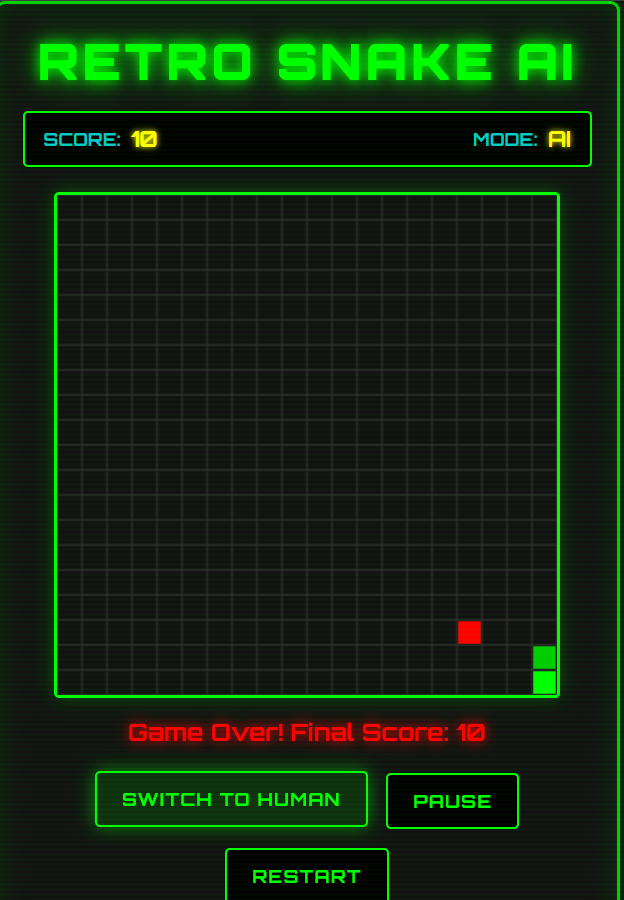
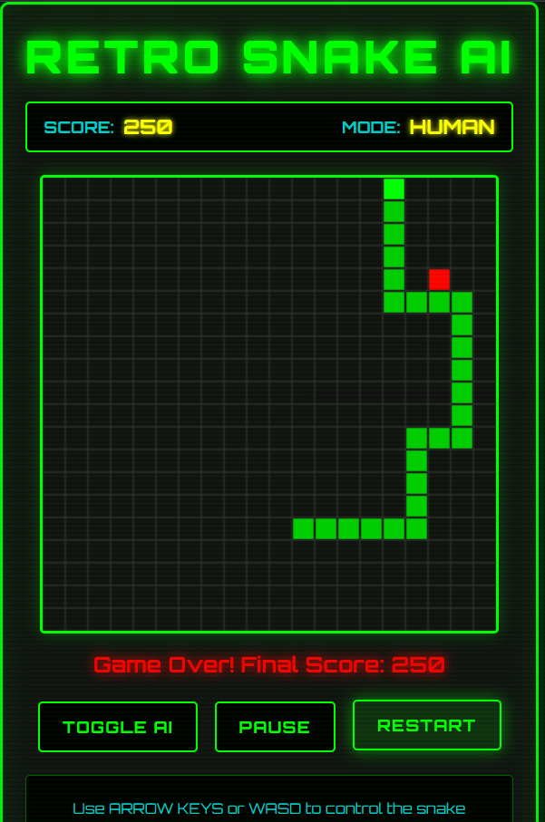

# Retro Snake AI 🐍

Classic Snake game with an AI-powered autonomous mode using **Kiro**.

---

*Check My Blog:https://builder.aws.com/content/370zvKCs0duHx3wiHRiFQFGOfIN/retro-snake-ai-classic-snake-with-ai-twist-using-kiro*
-----------
*Website URL : https://lively-souffle-21a7ae.netlify.app/*
-----
## 🎮 Demo Screenshots

  
*Human & AI mode in action.*

  
*Arrow keys / WASD for human mode, AI toggle for autonomous play.*

---

## 🕹 Features

- **Human Mode:** Arrow keys or WASD se khelo.  
- **AI Mode:** Snake apne aap safe moves choose karta hai.  
- **Real-time score tracking** for performance monitoring.  
- **Pause & Restart controls** for better gameplay.  
- **Retro grid-based UI** for classic feel.

---

## 🤖 AI Logic

AI snake **game state awareness** use karta hai:  

- Food position  
- Wall proximity  
- Self-collision  

AI random move nahi karta, **safest next move calculate karta hai real-time**.

**Kiro’s role:** Game architecture, AI logic, debugging, refactoring aur documentation me help.

---

## 🛠 Tech Stack

- HTML5 Canvas  
- CSS3  
- Vanilla JavaScript  
- **Kiro** (AI-assisted dev tool)

---

## 📂 File Roles

| File       | Role |
|------------|------|
| game.js    | Snake, food, score, canvas logic (class definitions) |
| ai.js      | AI decisions (direction logic) |
| script.js  | Controller / Orchestrator / Runtime engine |

---

## 🚀 How to Run

1. **Clone the repo:**  
   ```bash
   git clone https://github.com/PoojaMaurya0742/RetroSnakeAI.git
Open index.html in your browser (Chrome/Edge recommended).

Play in human mode or toggle AI mode.


